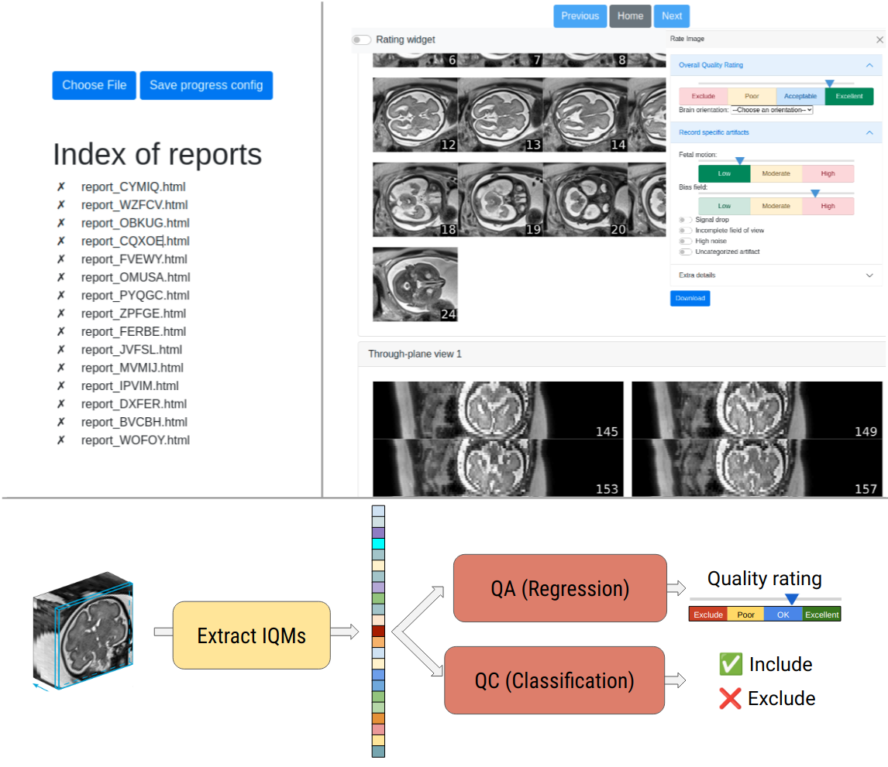

# FetMRQC

FetMRQC [[paper1](https://arxiv.org/pdf/2304.05879.pdf),[paper2](https://arxiv.org/pdf/2311.04780.pdf)] is a tool for quality assessment (QA) and quality control (QC) of T2-weighted (T2w) fetal brain MR images. It consists of two parts.
1. A **rating interface** (visual report) to standardize and facilitate quality annotations of T2w fetal brain MRI images, by creating interactive HTML-based visual reports from fetal brain scans. It uses a pair of low-resolution (LR) T2w images with corresponding brain masks to provide snapshots of the brain in the three orientations of the acquisition in the subject-space. 
2. A **QA/QC model** that can predict the quality of given T2w scans. It works on [BIDS](https://bids.neuroimaging.io/)-formatted datasets.

While raw data cannot be shared, the extracted image quality metrics are available on [Zenodo](https://zenodo.org/uploads/10118981). 

**Disclaimer.** Fetal brain QC is not intended for clinical use.




**Contents**
- [FetMRQC](#fetmrqc)
  - [Installation](#installation)
    - [Docker image](#docker-image)
      - [Running FetMRQC using docker](#running-fetmrqc-using-docker)
    - [From source](#from-source)
      - [Downloading checkpoints](#downloading-checkpoints)
      - [Final step: nnUNet \[7\] - Tricky part](#final-step-nnunet-7---tricky-part)
  - [Usage](#usage)
  - [Citing](#citing)
  - [Reproducibility and data](#reproducibility-and-data)
  - [License](#license)
  - [Acknowledgements](#acknowledgements)
  - [References](#references)
 

## Installation
### Docker image
*FetMRQC* is available as a docker image on docker hub. 

You can follow [this link](https://docs.nvidia.com/datacenter/cloud-native/container-toolkit/latest/install-guide.html) to install Docker and NVIDIA Container Toolkit. After installing docker, you can download *FetMRQC* with 
```
docker pull thsanchez/fetmrqc:0.1.1
```

This image by build using Ubuntu 22.04 and CUDA 12.1. Note that the image is heavy, around 35GB.

#### Running FetMRQC using docker
You have two options to run the *FetMRQC* docker. A wrapper script `run_docker.py` is provided in the *FetMRQC* repository and can run both main pipelines: the `reports` pipeline that generates visual reports from which quality can be assessed and the `inference` pipeline that computes the image quality metrics and performs inference using a pre-trained *FetMRQC* model. Both start from a [BIDS](https://bids.neuroimaging.io/) formatted directory of raw T2-weighted stacks of 2D slices. More details are available in the [usage](#usage) section.

The `run_docker.py` script automatically handles the mounting of folders onto the docker container, and can help people unfamiliar with docker containers. For those who are familiar with docker, we provide an example of how the inference pipeline can be run by directly calling the docker
```
docker run --rm -it 
  --gpus all
  --ipc=host --ulimit memlock=-1 --ulimit stack=67108864
  -v <your BIDS data folder>:/data/data 
  -v <your masks folder>:/data/masks 
  -v <your output folder>:/data/out 
  thsanchez/fetmrqc:0.1.2 qc_inference_pipeline 
  --bids_dir /data/data 
  --masks_dir /data/masks 
  --seg_dir /data/out/seg 
  --bids_csv /data/out/bids_csv.csv 
  --iqms_csv /data/out/iqms_csv.csv 
  --out_csv /data/out/out_csv.csv 
  --fetmrqc20_iqms  
  --classification
```


### From source
*FetMRQC* (`fetal_brain_qc`) was developed in Ubuntu 22.04 and tested for python 3.9.15

To install this repository, first clone it via
```
git clone git@github.com:Medical-Image-Analysis-Laboratory/fetal_brain_qc.git
```
and enter into the directory. Create a conda environment using `conda env create -n fetal_brain_qc python=3.9.15 ` Activate it using `conda activate fetal_brain_qc` and then install the repository using `python -m pip install -e .`

#### Downloading checkpoints
FetMRQC relies on pretrained models from various other works. In order to run it from source, you will need to download them and place them into the `fetal_brain_qc/models` folder.
-  **MONAIfbs [2].** Download the pretrained model from [Zenodo](https://zenodo.org/record/4282679#.X7fyttvgqL5), and to add it to `fetal_brain_qc/models/MONAIfbs_dynunet_ckpt.pt`.
-  **fetal-IQA [3,4,5].** Download the checkpoint `pytorch.ckpt` of [fetal-IQA](https://github.com/daviddmc/fetal-IQA) from [Zenodo](https://zenodo.org/record/7368570). Rename it to `fetal_IQA_pytorch.ckpt` and put it into `fetal_brain_qc/models`.
- **pl-fetal-brain-assessment [6].** Download the checkpoint of [pl-fetal-brain-assessment](https://github.com/FNNDSC/pl-fetal-brain-assessment) from [Zenodo](https://zenodo.org/records/8309634/files/weights_resnet_sw2_k1.hdf5?download=1). Rename it to `FNNDSC_qcnet_ckpt.hdf5` and put it into `fetal_brain_qc/models`
- **Pretrained nnUNetv2 [7] model.** Download the checkpoint folder from [Zenodo](https://zenodo.org/records/10785234/files/nnUNet.zip), unzip it and put it into `fetal_brain_qc/models`. 

#### Final step: nnUNet [7] - Tricky part
Create a **new** environment for nnUNet (exit the current one by doing `conda deactivate`), using `conda env create -n nnunet` and activate it. Then, following the [nnUNet installation instructions](https://github.com/MIC-DKFZ/nnUNet/blob/master/documentation/installation_instructions.md), install pytorch:
> Install PyTorch as described on their website (conda/pip). Please install the latest version with support for your hardware (cuda, mps, cpu). DO NOT JUST pip install nnunetv2 WITHOUT PROPERLY INSTALLING PYTORCH FIRST. For maximum speed, consider compiling pytorch yourself (experienced users only!).

After that, clone the repository from [nnUNet V2](https://github.com/MIC-DKFZ/nnUNet) ([v2.0](https://github.com/MIC-DKFZ/nnUNet/releases/tag/v2.0)) using `git clone https://github.com/MIC-DKFZ/nnUNet.git`. Go into the repository and install it using `python -m pip install -e .` If the installation is successful, you should be able to call from the command line `nnUNetv2_predict`.

**Note.** We used the commit `af8c9fb1fe5c695020aa7c30c174a5e61efdd95d` of nnUNet.

**Note.** You do *not* need to set the paths as told in the nnUNet installation

You can now exit the new environment and re-activate `fetal_brain_qc`. 

**Note.** This installation is done in order to be able to run `qc_compute_segmentation` (more on it below), in which you need to provide `nnunet_env_path`, the path to the nnUNet python environment that you can obtain using `conda env list`


## Usage
*FetMRQC* starts from a [BIDS](https://bids.neuroimaging.io/) dataset (containing `NIfTI` formatted images).  

For **reports** generation, the recommended workflow is to use `qc_reports_pipeline`.

```
usage: qc_reports_pipeline [-h] --bids_dir BIDS_DIR --masks_dir MASKS_DIR --reports_dir REPORTS_DIR [--ckpt_path CKPT_PATH] [--mask_pattern MASK_PATTERN] [--bids_csv BIDS_CSV] [--seed SEED]

Given a `bids_dir`, lists the LR series in the directory, computes the brain masks using MONAIfbs and uses the masks to compute visual reports that can be used for manual rating.

optional arguments:
  -h, --help            show this help message and exit
  --bids_dir BIDS_DIR   BIDS directory containing the LR series. (default: None)
  --masks_dir MASKS_DIR
                        Root of the BIDS directory where brain masks will be stored. (default: None)
  --reports_dir REPORTS_DIR
                        Directory where the reports will be stored. (default: None)
  --ckpt_path CKPT_PATH
                        Path to the checkpoint of the MONAIfbs model. (default: /home/tsanchez/Documents/mial/repositories/qc_fetal_brain/fetal_brain_qc/models/MONAIfbs_dynunet_ckpt.pt)
  --mask_pattern MASK_PATTERN
                        Pattern according to which the masks will be stored. By default, masks will be stored in
                        "<masks_dir>/sub-{subject}[/ses-{session}][/{datatype}]/sub-{subject}[_ses-{session}][_acq-{acquisition}][_run-{run}]_{suffix}.nii.gz", and the different fields will be
                        substituted based on the structure of bids_dir. (default:
                        sub-{subject}[/ses-{session}][/{datatype}]/sub-{subject}[_ses-{session}][_acq-{acquisition}][_run-{run}]_{suffix}.nii.gz)
  --bids_csv BIDS_CSV   CSV file where the list of available LR series and masks will be stored. (default: bids_csv.csv)
  --seed SEED           Seed for the random number generator. (default: 42)

```
**Remark.** This script runs the whole reports generating pipeline of *FetMRQC*, i.e.  brain extraction ->  listing of BIDS directory and masks into a CSV file -> Report generation -> Index file generation. 

For **inference**, the recommended workflow is  `qc_inference_pipeline`.

```
usage: qc_inference_pipeline [-h] --bids_dir BIDS_DIR --masks_dir MASKS_DIR --seg_dir SEG_DIR [--bids_csv BIDS_CSV] [--iqms_csv IQMS_CSV] [--out_csv OUT_CSV] [--iqms IQMS [IQMS ...]] [--nprocs NPROCS]
                             [--fetmrqc20_iqms | --no-fetmrqc20_iqms] [--ckpt_path CKPT_PATH] [--mask_pattern MASK_PATTERN] [--seed SEED] [--classification] [--regression] [--custom_model CUSTOM_MODEL]

Given a `bids_dir`, lists the LR series in the directory, computes brain masks and segmentations, uses them to extract IQMs and perform inference using one of the pretrained FetMRQC models. The output
is a CSV file containing the predictions and IQMs.

optional arguments:
  -h, --help            show this help message and exit
  --bids_dir BIDS_DIR   BIDS directory containing the LR series. (default: None)
  --masks_dir MASKS_DIR
                        Root of the BIDS directory where brain masks will be/are stored. If masks already exist, they will be used. (default: None)
  --seg_dir SEG_DIR     Root of the directory where brain segmentations will be stored. If segmentations already exist, they will be used. (default: None)
  --bids_csv BIDS_CSV   CSV file where the list of available LR series and masks will be stored. (default: bids_csv.csv)
  --iqms_csv IQMS_CSV   CSV file where the computed IQMs will be stored. (default: iqms_csv.csv)
  --out_csv OUT_CSV     CSV file where the predictions from FetMRQC will be stored. (default: out_csv.csv)
  --iqms IQMS [IQMS ...]
                        List of IQMs that will be computed (default: all)
  --nprocs NPROCS       Number of processes to use for the computation of the IQMs. (default: 4)
  --fetmrqc20_iqms, --no-fetmrqc20_iqms
                        Whether the IQMs from FetMRQC-20 should be computed (default: False)
  --ckpt_path CKPT_PATH
                        Path to the checkpoint of the MONAIfbs model. (default: /home/tsanchez/Documents/mial/repositories/qc_fetal_brain/fetal_brain_qc/models/MONAIfbs_dynunet_ckpt.pt)
  --mask_pattern MASK_PATTERN
                        Pattern according to which the masks will be stored. By default, masks will be stored in
                        "<masks_dir>/sub-{subject}[/ses-{session}][/{datatype}]/sub-{subject}[_ses-{session}][_acq-{acquisition}][_run-{run}]_{suffix}.nii.gz", and the different fields will be
                        substituted based on the structure of bids_dir. (default:
                        sub-{subject}[/ses-{session}][/{datatype}]/sub-{subject}[_ses-{session}][_acq-{acquisition}][_run-{run}]_{suffix}.nii.gz)
  --seed SEED           Seed to control the randomization (to be used with randomize=True). (default: 42)
  --classification      Whether to perform classification or regression. (default: True)
  --regression          Whether to perform classification or regression. (default: True)
  --custom_model CUSTOM_MODEL
                        Path to a custom model, trained using run_train_fetmrqc.py. (default: None)

```

**Remark.** This script runs the whole inference pipeline of *FetMRQC*, i.e.  brain extraction ->  listing of BIDS directory and masks into a CSV file -> Segmentation of the brain -> IQMs extraction -> Inference using a pretrained FetMRQC model

Each part of the pipeline can also be called individually:

- `qc_brain_extraction`:
```
usage: qc_brain_extraction [-h] --bids_dir BIDS_DIR --masks_dir MASKS_DIR [--ckpt_path CKPT_PATH] [--mask_pattern MASK_PATTERN]

Given a `bids_dir`, lists the LR series in the directory and computes the brain masks using MONAIfbs (https://github.com/gift-surg/MONAIfbs/tree/main). Save the masks into the `masks_dir` folder,
follwing the same hierarchy as the `bids_dir`

optional arguments:
  -h, --help            show this help message and exit
  --bids_dir BIDS_DIR   BIDS directory containing the LR series. (default: None)
  --masks_dir MASKS_DIR
                        Root of the BIDS directory where brain masks will be stored. (default: None)
  --ckpt_path CKPT_PATH
                        Path to the checkpoint of the MONAIfbs model. (default: /home/tsanchez/Documents/mial/repositories/qc_fetal_brain/fetal_brain_qc/models/MONAIfbs_dynunet_ckpt.pt)
  --mask_pattern MASK_PATTERN
                        Pattern according to which the masks will be stored. By default, masks will be stored in
                        "<masks_dir>/sub-{subject}[/ses-{session}][/{datatype}]/sub-{subject}[_ses-{session}][_acq-{acquisition}][_run-{run}]_{suffix}.nii.gz", and the different fields will be
                        substituted based on the structure of bids_dir. (default:
                        sub-{subject}[/ses-{session}][/{datatype}]/sub-{subject}[_ses-{session}][_acq-{acquisition}][_run-{run}]_{suffix}.nii.gz)
```

- `qc_list_bids_csv` 
```
usage: qc_list_bids_csv [-h] --bids_dir BIDS_DIR [--mask_patterns MASK_PATTERNS [MASK_PATTERNS ...]] [--mask_patterns_base MASK_PATTERNS_BASE [MASK_PATTERNS_BASE ...]] [--out_csv OUT_CSV]
                        [--anonymize_name | --no-anonymize_name] [--seed SEED]

Given a `bids_dir`, lists the LR series in the directory and tries to find corresponding masks given by `mask_patterns`. Then, saves all the found pairs of (LR series, masks) in a CSV file at `out_csv`

optional arguments:
  -h, --help            show this help message and exit
  --bids_dir BIDS_DIR   BIDS directory containing the LR series. (default: None)
  --mask_patterns MASK_PATTERNS [MASK_PATTERNS ...]
                        Pattern(s) to find the LR masks corresponding to the LR series. Patterns will be of the form
                        "sub-{subject}[/ses-{session}][/{datatype}]/sub-{subject}[_ses-{session}][_acq-{acquisition}][_run-{run}]_{suffix}.nii.gz", and the different fields will be substituted based on
                        the structure of bids_dir. The base directory from which the search will be run can be changed with `--mask-pattern-base`. (default: None)
  --mask_patterns_base MASK_PATTERNS_BASE [MASK_PATTERNS_BASE ...]
                        Base folder(s) from which the LR masks must be listed. The method will look for masks at `mask-pattern-base`/`mask-patterns`. In this case, both `mask-patterns` and `mask-
                        pattern-base` should be of the same length. (default: None)
  --out_csv OUT_CSV     CSV file where the list of available LR series and masks is stored. (default: bids_csv.csv)
  --anonymize_name, --no-anonymize_name
                        Whether an anonymized name must be stored along the paths in `out_csv`. This will determine whether the reports will be anonymous in the end. (default: True)
  --seed SEED           Seed for the random number generator. (default: None)
```

- `qc_generate_reports`
```
usage: Given a BIDS CSV file, generates visual reports for annotation. [-h] --bids_csv BIDS_CSV --out_dir OUT_DIR [--sr | --no-sr] [--add_js | --no-add_js]

optional arguments:
  -h, --help            show this help message and exit
  --bids_csv BIDS_CSV   Path where the bids config csv file is stored. (default: None)
  --out_dir OUT_DIR     Path where the reports will be stored. (default: None)
  --sr, --no-sr         Whether the reports to be generated are for SR data. (default: False)
  --add_js, --no-add_js
                        Whether some javascript should be added to the report for interaction with the index file. (default: True)
```

- `qc_generate_index`
```
usage: qc_generate_index [-h] [--reports_dirs REPORTS_DIRS [REPORTS_DIRS ...]] [--add_script_to_reports | --no-add_script_to_reports] [--use_ordering_file | --no-use_ordering_file]
                         [--navigation | --no-navigation] [--seed SEED]

Given a list of reports, generates an index.html file to navigate through them.

optional arguments:
  -h, --help            show this help message and exit
  --reports_dirs REPORTS_DIRS [REPORTS_DIRS ...]
                        Paths where the reports are located (default: None)
  --add_script_to_reports, --no-add_script_to_reports
                        Whether some javascript should be added to the report for interaction with the index file. (default: False)
  --use_ordering_file, --no-use_ordering_file
                        Whether ordering.csv should be used to construct the ordering of index.html. The file should be located in the report-path folder. (default: False)
  --navigation, --no-navigation
                        Whether the user should be able to freely navigate between reports. This is disabled for rating, to force user to process reports sequentially. (default: False)
  --seed SEED           Seed to control the randomization (to be used with randomize=True). (default: 42)
```

- `qc_segmentation`
```
usage: qc_segmentation [-h] --bids_csv BIDS_CSV [--out_path OUT_PATH] [--ckpt_path_model CKPT_PATH_MODEL] [--nnunet_res_path NNUNET_RES_PATH] [--nnunet_env_path NNUNET_ENV_PATH] [--device {cuda,cpu}]

Compute segmentation on low resolution clinical acquisitions, using a pretrained deep learning model.

optional arguments:
  -h, --help            show this help message and exit
  --bids_csv BIDS_CSV   Path where the bids config csv file is located. (default: None)
  --out_path OUT_PATH   Path where the segmentations will be stored. (if not specified in bids_csv) (default: None)
  --ckpt_path_model CKPT_PATH_MODEL
                        Path to the checkpoint to be used. (default: None)
  --nnunet_res_path NNUNET_RES_PATH
                        Path to the nnunet folder containing the checkpoint. (default: /home/tsanchez/Documents/mial/repositories/qc_fetal_brain/fetal_brain_qc/models/nnUNet)
  --nnunet_env_path NNUNET_ENV_PATH
                        Path to the nnunet folder containing the checkpoint (from `conda env list`). (default: /home/tsanchez/anaconda3/envs/nnunet)
  --device {cuda,cpu}   Device to use for the nnUNet inference. (default: cuda)
```

- `qc_compute_iqms`

**Note.** If you want to run the metrics computation using segmentation-based metrics, you need to run `qc_compute_segmentation` prior to calling this script.
```
usage: qc_compute_iqms [-h] --bids_csv BIDS_CSV --out_csv OUT_CSV [--metrics METRICS [METRICS ...]] [--use_all_metrics | --no-use_all_metrics] [--ckpt_path_slice_iqa CKPT_PATH_SLICE_IQA]
                       [--ckpt_path_stack_iqa CKPT_PATH_STACK_IQA] [--device DEVICE] [--continue-run | --no-continue-run] [--use_prob_seg | --no-use_prob_seg] [--nprocs NPROCS]
                       [--verbose | --no-verbose]

Computes quality metrics from given images.

optional arguments:
  -h, --help            show this help message and exit
  --bids_csv BIDS_CSV   Path where the bids config csv file is located. (default: None)
  --out_csv OUT_CSV     Path where the IQMs will be stored. (default: None)
  --metrics METRICS [METRICS ...]
                        Metrics to be evaluated. (default: ['centroid', 'dl_slice_iqa_full', 'dl_stack_iqa_full', 'rank_error', 'mask_volume', 'ncc', 'nmi'])
  --use_all_metrics, --no-use_all_metrics
                        Whether all metrics should be evaluated (default: False)
  --ckpt_path_slice_iqa CKPT_PATH_SLICE_IQA
                        Path to the checkpoint of the fetal IQA pytorch model (by Junshen Xu at MIT). (default:
                        /home/tsanchez/Documents/mial/repositories/qc_fetal_brain/fetal_brain_qc/models/fetal_IQA_pytorch.ckpt)
  --ckpt_path_stack_iqa CKPT_PATH_STACK_IQA
                        Path to the checkpoint of the fetal IQA tensorflow model (by Ivan Legorreta FNNDSC). (default:
                        /home/tsanchez/Documents/mial/repositories/qc_fetal_brain/fetal_brain_qc/models/FNNDSC_qcnet_ckpt.hdf5)
  --device DEVICE       Device to be used for the deep learning model. (default: cuda:0)
  --continue-run, --no-continue-run
                        Whether QC run should re-use existing results if a metrics.csv file at `out_path`/metrics.csv. (default: True)
  --use_prob_seg, --no-use_prob_seg
                        Whether to use the probability segmentation or the binary segmentation. (default: True)
  --nprocs NPROCS       Number of processes to use for multiprocessing. (default: 4)
  --verbose, --no-verbose
                        Enable verbose. (default: False)
```

- `qc_inference`
```
usage: qc_inference [-h] --iqms_csv IQMS_CSV --out_csv OUT_CSV [--ckpt_path CKPT_PATH] [--classification] [--regression] [--fetmrqc20 | --no-fetmrqc20] [--custom_model CUSTOM_MODEL]

Performs FetMRQC inference, given a pretrained model.

optional arguments:
  -h, --help            show this help message and exit
  --iqms_csv IQMS_CSV   Path where the IQMs csv file is located. (default: None)
  --out_csv OUT_CSV     CSV file where the predicted results will be stored. (default: None)
  --ckpt_path CKPT_PATH
                        Path to the checkpoint of the fetal IQA pytorch model. (default: None)
  --classification      Whether to perform classification or regression. (default: True)
  --regression          Whether to perform classification or regression. (default: True)
  --fetmrqc20, --no-fetmrqc20
                        Whether to use FetMRQC20 IQMs. (default: False)
  --custom_model CUSTOM_MODEL
                        Path to a custom model, trained using run_train_fetmrqc.py. (default: None)

```

- `qc_training`:
```
usage: Train a FetMRQC model. [-h] [--dataset DATASET] [--first_iqm FIRST_IQM] [--classification] [--regression] [--fetmrqc20 | --no-fetmrqc20] [--iqms_list IQMS_LIST [IQMS_LIST ...]]
                              [--save_path SAVE_PATH]

optional arguments:
  -h, --help            show this help message and exit
  --dataset DATASET     Path to the csv file dataset.
  --first_iqm FIRST_IQM
                        First IQM in the csv of the dataset.
  --classification      Whether to perform classification or regression.
  --regression          Whether to perform classification or regression.
  --fetmrqc20, --no-fetmrqc20
                        Whether to use FetMRQC20 IQMs. (default: False)
  --iqms_list IQMS_LIST [IQMS_LIST ...]
                        Custom list of IQMs to use. By default, all IQMs are used.
  --save_path SAVE_PATH
                        Where to save the model.
```
- `qc_niftymic_qc`: Run the QC from NiftyMIC.
```
usage: qc_niftymic_qc [-h] --out-csv OUT_CSV --bids-csv BIDS_CSV [--continue-run | --no-continue-run]

Exclude outlying stacks for each subject. Based on the paper from .

optional arguments:
  -h, --help            show this help message and exit
  --out-csv OUT_CSV     Path where the IQA results will be stored. (default: None)
  --bids-csv BIDS_CSV   Path where the bids config csv file is located. (default: None)
  --continue-run, --no-continue-run
                        Whether QC run should re-use existing results if a metrics.csv file at `out_path`/metrics.csv. (default: True)

```

- `qc_ratings_to_csv`: When manual QA/QC annotations have been done.
```
usage: qc_ratings_to_csv [-h] [--out_csv OUT_CSV] ratings_dir bids_csv

Given a `ratings_dir`, and a `bids_csv`, formats the ratings into a single csv file containing all information.

positional arguments:
  ratings_dir        Directory containing the ratings.
  bids_csv           CSV file where the list of available LR series and masks is stored.

optional arguments:
  -h, --help         show this help message and exit
  --out_csv OUT_CSV  CSV file where the ratings will be stored (default: `<ratings_dir>/ratings.csv`). (default: None)

```
## Citing
If you found this work useful, please cite the following articles.

For the large, multi-centric evaluation and model:
> Sanchez, T., Esteban, O., Gomez, Y., Pron, A., Koob, M., Dunet, V., Girard, N., Jakab, A., Eixarch, E., Auzias, G., Bach Cuadra, M. (2023). "FetMRQC: an open-source machine learning framework for multi-centric fetal brain MRI quality control." [arXiv preprint arXiv:2311.04780](https://arxiv.org/pdf/2311.04780.pdf)

For the original model ([arXiv link](https://arxiv.org/pdf/2304.05879.pdf)):
> Sanchez, T., Esteban, O., Gomez, Y., Eixarch, E., Bach Cuadra, M. (2023). "FetMRQC: Automated Quality Control for Fetal Brain MRI." PIPPI MICCAI Workshop 2023. [https://doi.org/10.1007/978-3-031-45544-5_1](https://doi.org/10.1007/978-3-031-45544-5_1)


## Reproducibility and data
As fetal brain imaging contains highly sensitive data, sharing the raw data is not possible. However, as *FetMRQC* relies on extracted image quality metrics, these can be easily shared for other researchers to re-train or enhance FetMRQC based models. They are available on [Zenodo](https://zenodo.org/uploads/10118981).

## License
Copyright 2023 Medical Image Analysis Laboratory. FetMRQC is licensed under the Apache License, Version 2.0 (the "License"); you may not use this file except in compliance with the License. You may obtain a copy of the License at [http://www.apache.org/licenses/LICENSE-2.0](http://www.apache.org/licenses/LICENSE-2.0).
Unless required by applicable law or agreed to in writing, software distributed under the License is distributed on an "AS IS" BASIS, WITHOUT WARRANTIES OR CONDITIONS OF ANY KIND, either express or implied. See the License for the specific language governing permissions and limitations under the License.


## Acknowledgements
This project was supported by the ERA-net Neuron MULTIFACT – SNSF grant [31NE30_203977](https://data.snf.ch/grants/grant/203977).

## References
[1] Esteban, Oscar, et al. "MRIQC: Advancing the automatic prediction of image quality in MRI from unseen sites." PloS one 12.9 (2017): e0184661.

[2] Ranzini, Marta, et al. "MONAIfbs: MONAI-based fetal brain MRI deep learning segmentation." arXiv preprint arXiv:2103.13314 (2021).

[3] Semi-supervised learning for fetal brain MRI quality assessment with ROI consistency

[4] Gagoski, Borjan, et al. "Automated detection and reacquisition of motion‐degraded images in fetal HASTE imaging at 3 T." Magnetic Resonance in Medicine 87.4 (2022): 1914-1922.

[5] Lala, Sayeri, et al. "A deep learning approach for image quality assessment of fetal brain MRI." Proceedings of the 27th Annual Meeting of ISMRM, Montréal, Québec, Canada. 2019.

[6] Legorreta et al. https://github.com/FNNDSC/pl-fetal-brain-assessment

[7] Isensee, F., Jaeger, P. F., Kohl, S. A., Petersen, J., & Maier-Hein, K. H. (2021). nnU-Net: a self-configuring method for deep learning-based biomedical image segmentation. Nature methods, 18(2), 203-211.
